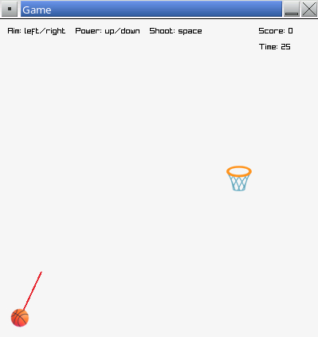

# Assignment - Basketball

For this assignment you will create a simple game to shoot basketballs at a hoop.

## Description

The game will allow the player to shoot a ball at a hoop. The player will be able to control the angle and power of the shot. When the player makes a shot, the hoop moves to a new, random location.

This assignment uses the [raylib](https://www.raylib.com/) library. This library provides simple abstractions for window management, user input, image loading, graphics rendering, font rendering, and more. For a list of functions the library provides, see the [cheatsheet](https://www.raylib.com/cheatsheet/cheatsheet.html).

## Phases

There are different parts to this assignment. You will work through each part in succession. Each part will have explanations for you to read and coding tasks to complete.

The 👉 symbol is used to indicate where you need to write code or make a code change. Sometimes the instructions will provide code for you to copy or reference. Other times you will have to write the code on your own.

This assignment breaks the development of the game up into small pieces. The ▶️ symbol indicates where you should compile and run your program to verify there are no errors. Small, incremental changes will help prevent you from getting overwhelmed. If you have errors, resolve them before moving on in the assignment.

The parts of the assignment are listed below:

- [1 - Setup](./docs/1-setup.md)
- [2 - Structs](./docs/2-structs.md)
- [3 - Drawing](./docs/3-drawing.md)
- [4 - State](./docs/4-state.md)
- [5 - Shooting](./docs/5-shooting.md)
- [6 - Aiming](./docs/6-aiming.md)
- [7 - Gravity](./docs/7-gravity.md)
- [8 - Scoring](./docs/8-scoring.md)
- [9 - Timer](./docs/9-timer.md)

## Submission

After completing all parts of the assignment, make sure you have committed and pushed your changes to GitHub.
