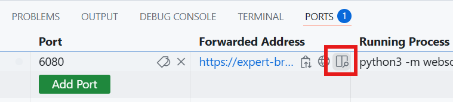
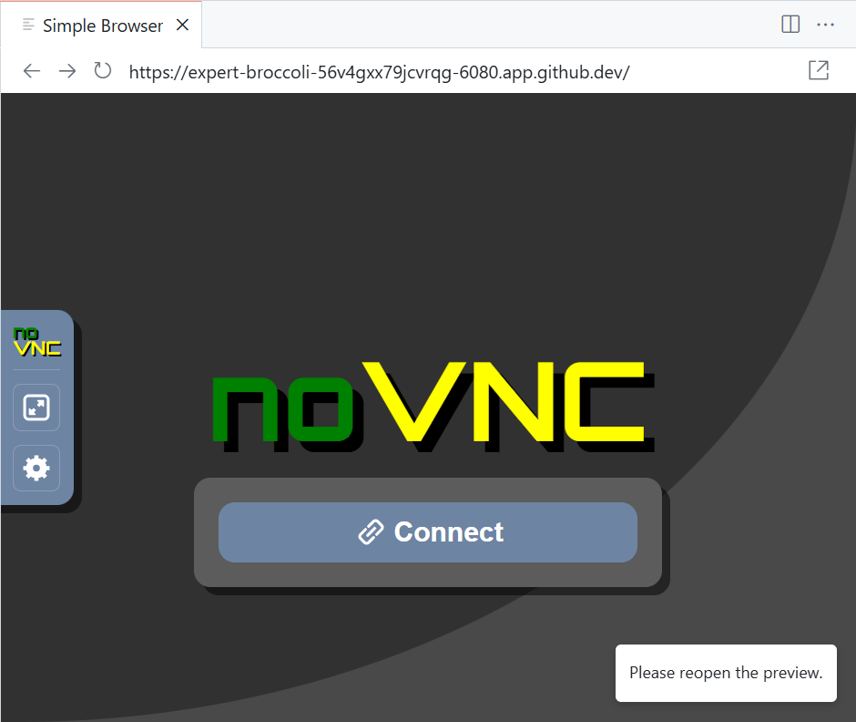
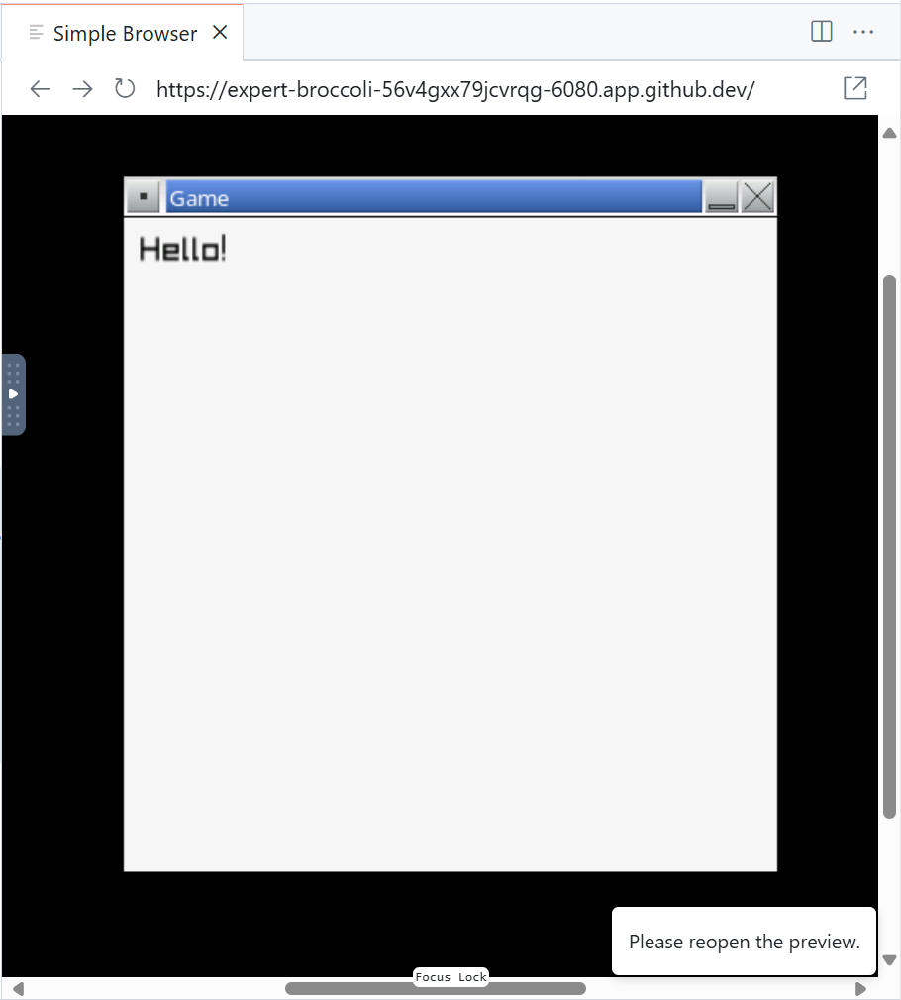

# Part 1 - Setup

This part of the assignment ensures you can build the project and view the application window.

## Open the Project

Open your assignment repository in a GitHub Codespace. You can also develop locally on your computer (either natively or within a dev container).

Wait for the container to build and initialize. This may take a few minutes.

Once loaded, click the play button at the bottom of the editor window to build and run the project.

When prompted, select the Clang compiler. If no compilers are listed, click **[Scan for kits]** and try again.

Open the **Ports** tab in the bottom editor panel and click the **Preview in Editor** button.

The preview browser should open within VS Code, showing a noVNC page.

Click **Connect** to connect to the desktop environment running within your container.

You should see a game window with the message "Hello!". You may need to scroll the preview browser to ensure the entire game window is visible.

⚠️ When you make code changes, close the game window, then build and run using the play button at the bottom of the editor window. Otherwise, you will still see the old version of your application running in the preview browser.

## End of Part 1

At this point, you should:

- Be able to build and run the starter project.
- See the game window with the message "Hello!" displayed.

When ready, proceed to [part 2](./2-structs.md).
