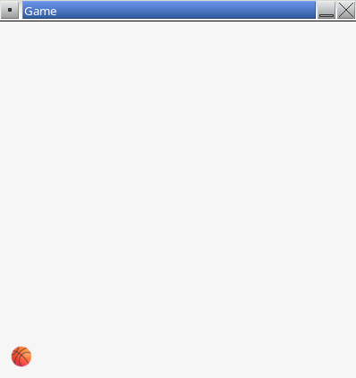
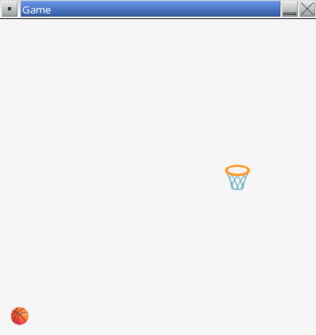

# Part 3 - Drawing

In this part of the assignment you will write code to draw the ball and hoop on screen.

## Remove the "Hello!" Text

Find the `DrawFrame()` function in your `main.cpp` file.

👉 Delete the line of code that calls `DrawText()`.

```cpp
void DrawFrame()
{
    // Delete the line below
    DrawText("Hello!", 10, 10, 20, BLACK);
}
```

Your `DrawFrame()` function should now be empty.

**▶️ Compile and run the program.** There should be no errors and the "Hello!" message should no longer be visible in the game window.

## Draw the Ball

You will now add code to draw a basketball texture in the lower-left corner of the screen.

Find the section at the top of `main.cpp` where global variables are stored.

👉 Create a new variable to store the position of the ball. Here is an example:

```cpp
/* -----------------
Variables
----------------- */

Camera2D camera;
Texture2D ballTexture;
Texture2D hoopTexture;

Vector2 ballPos; // <--- New
```

**▶️ Compile the program.** Verify there are no errors.

The position of the ball needs to be initialized when the game starts. The ball will always reset to this initial position after the player shoots.

Find the section at the top of `main.cpp` where global constants are stored.

👉 Create two new constants defining the initial ball position. Here is an example:

```cpp
/* -----------------
Constants
----------------- */

const int SCREEN_WIDTH = 400;
const int SCREEN_HEIGHT = 400;

const float INITIAL_BALL_X = 25.0f;  // <--- New
const float INITIAL_BALL_Y = 375.0f; // <--- New
```

**▶️ Compile the program.** Verify there are no errors.

Find the `Startup()` function in `main.cpp`. This function is executed once when the game starts. Any initialization code can be put in here.

👉 Add two lines of code to set the `x` and `y` coordinates of `ballPos` to the initial values defined in the constants. Here is an example:

```cpp
void Startup()
{
    // Existing code for loading textures...

    // Initial position of the ball
    ballPos.x = INITIAL_BALL_X;
    ballPos.y = INITIAL_BALL_Y;
}
```

**▶️ Compile the program.** Verify there are no errors.

Find the `DrawFrame()` function in `main.cpp`.

👉 Add the following code inside of `DrawFrame()`:

```cpp
void DrawFrame()
{
    // Draw ball
    Vector2 drawBallPos;
    drawBallPos.x = ballPos.x - (ballTexture.width * 0.5f);
    drawBallPos.y = ballPos.y - (ballTexture.height * 0.5f);
    DrawTextureEx(ballTexture, drawBallPos, 0, 1, WHITE);
}
```

This code creates a local variable named `drawBallPos`. It offsets the texture to center it with the `ballPos` coordinates.

The `DrawTextureEx()` function takes five parameters:

1. The texture to draw. In this case, `ballTexture`. The code to load this texture already exists.
2. The position to draw the texture. Use `drawBallPos` that was computed previously.
3. The rotation of the image. In this case `0` because we don't want the image to be rotated.
4. The scale of the image. In this case `1` because we don't want to scale the image. A scale of `2` would draw the image as twice its normal size.
5. The tint of the image. We don't want to apply a color tint to the texture, so use `WHITE`.

**▶️ Compile and run the program.** Verify there are no errors. You should see a ball displayed in the lower-left corner of the game window.



## Draw the Hoop

👉 Update `main.cpp` to draw a hoop texture somewhere on the screen. This will be very similar to how the ball texture is drawn.

The hoop texture is already loaded in the `hoopTexture` variable.

When you are finished, you should see something similar to the screenshot below.



## End of Part 3

You should now have a ball and hoop drawn in the game window.

When ready, proceed to [part 4](./4-state.md).
