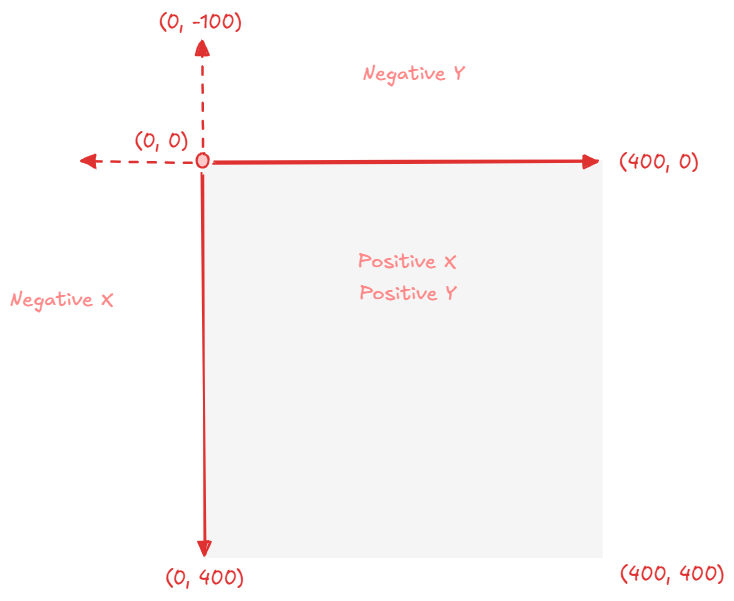
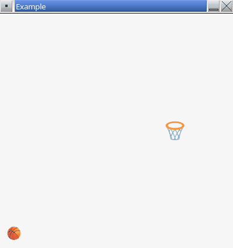

# Part 5 - Shooting

In this part of the assignment you will add code to shoot the ball and cause it to move across the game window.

## Shooting the Ball

A trigger is needed to switch the ball from the "not flying" state into the "flying" state (i.e., we need a way for the player to shoot the ball).

👉 Inside the `UpdateFrame()` function, find the branch of code that handles when the ball is _not_ flying. Inside that branch, add a nested `if` statement to check if the space bar is pressed and set `isFlying` to `true`. Here is an example:

```cpp
if (isFlying) {
    // Ball has been shot and is in flight

    // TODO
}
else {
    // Ball is waiting to be shot

    // Check if player shoots ball
    if (IsKeyPressed(KEY_SPACE)) {
        isFlying = true;
    }
}
```

**▶️ Compile the program.** Verify there are no errors.

Pressing the space bar at this point does not do anything. The ball doesn't move yet; you'll implement this next.

## Coordinate System

As a quick reminder, the world for this assignment has two dimensions (2D). The coordinate system looks like this:



## Velocity

Velocity tells us how fast an object is moving and in which direction.

This assignment uses a 2D world. Therefore, the velocity of the ball has two dimensions (`x` and `y`).

👉 Create a new `Vector2` global variable to track the velocity of the ball.

```cpp
Vector2 ballVel;
```

The velocity of the ball should start at `{0, 0}`.

👉 Find the `Startup()` function in `main.cpp` and add code to initialize the `x` and `y` components of the ball's velocity to `0`.

**▶️ Compile the program.** Verify there are no errors.

## Initial Velocity

When the player shoots the ball, the ball's velocity needs set to an _initial velocity_.

Let's hard code an initial launch velocity.

👉 After detecting the space bar is pressed and setting `isFlying` to `true`, add some code to set the velocity of the ball. Here is an example:

```cpp
if (isFlying) {
    // Ball has been shot and is in flight

    // TODO
}
else {
    // Ball is waiting to be shot

    // Check if player shoots ball
    if (IsKeyPressed(KEY_SPACE)) {
        isFlying = true;

        // Hard coded initial velocity
        ballVel.x = 20.0f;
        ballVel.y = -20.0f;
    }
}
```

**▶️ Compile the program.** Verify there are no errors.

The ball still does not move. Next, you will implement code to update the position of the ball.

## Ball Position

During each frame update, you must update the position of the ball based on its velocity.

Since velocity is measured in units of $distance\over{time}$, we need to know how much time has passed since the last frame. This is called "delta time" (the change in time).

raylib provides the `GetFrameTime()` function that returns the number of seconds that have elapsed since the last frame.

👉 At the beginning of the `UpdateFrame()` function, add code to find the number of seconds that have elapsed since the last frame. Here is an example:

```cpp
void UpdateFrame()
{
    // Time delta (in seconds) since last frame
    float deltaTime = GetFrameTime();

    // Existing code here...
}
```

**▶️ Compile the program.** Verify there are no errors.

Using `deltaTime`, the ball's new position can be computed using its velocity. Each coordinate (`x` and `y`) can be updated independently. Let's look at `x` first.

Here is an example of code that updates the ball's `x` coordinate based on the `x` component of the velocity:

```cpp
ballPos.x += ballVel.x * deltaTime;
```

- Make sure to use `+=` instead of `=` here. We want to _increment_ the ball's position.
- Note that `ballPos` is on the _left_ side of the statement and `ballVel` is on the _right_. A common error is to use the wrong variables in the wrong places (i.e., accidentally updating velocity instead of updating position).

👉 Write code inside the `UpdateFrame()` function to update the `x` and `y` coordinate of the ball's position based on the velocity. **This should only happen when the ball is flying.**

**▶️ Compile and run the program.** Press the space bar and you should see the ball start moving up and to the right. Try tweaking the initial velocity and observe the results.



## End of Part 5

At this point your game should show a ball and hoop. Pressing the space bar should shoot the ball up and to the right.

When ready, proceed to [part 6](./6-aiming.md).
