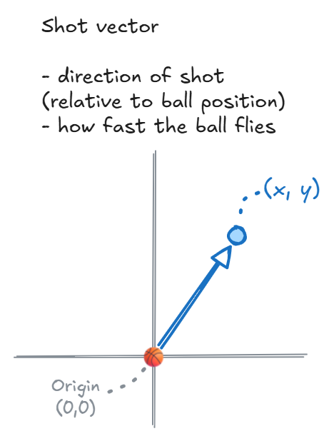
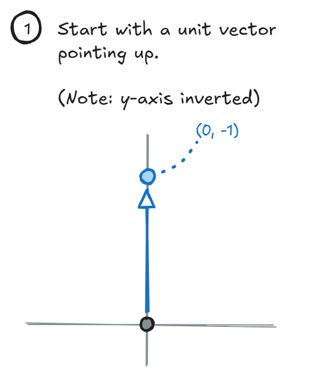
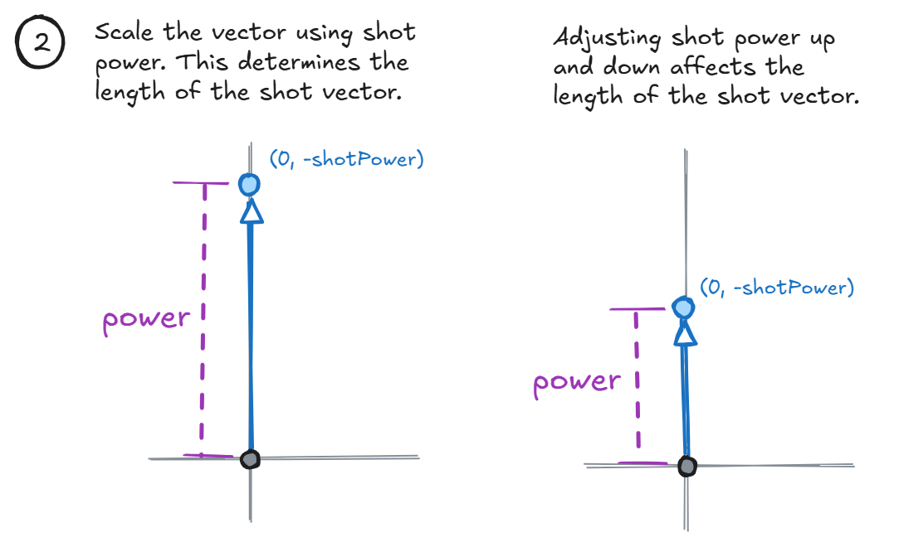
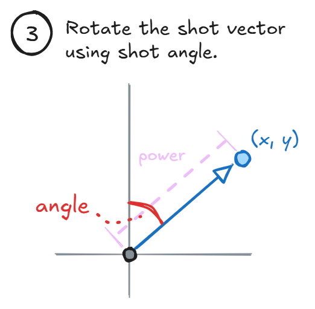
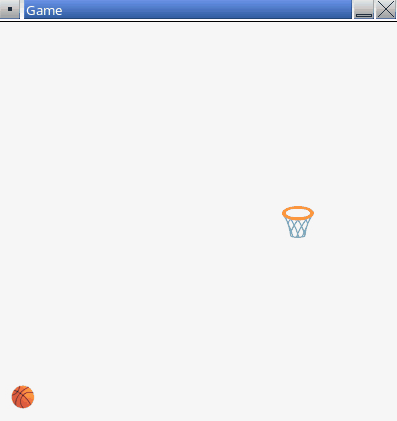
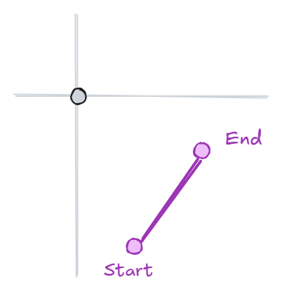
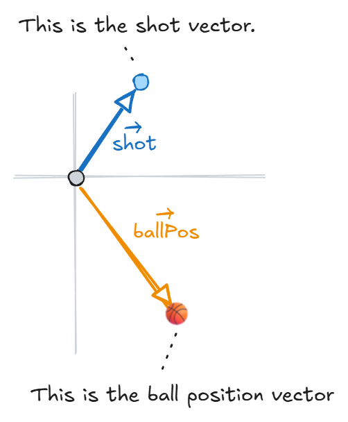
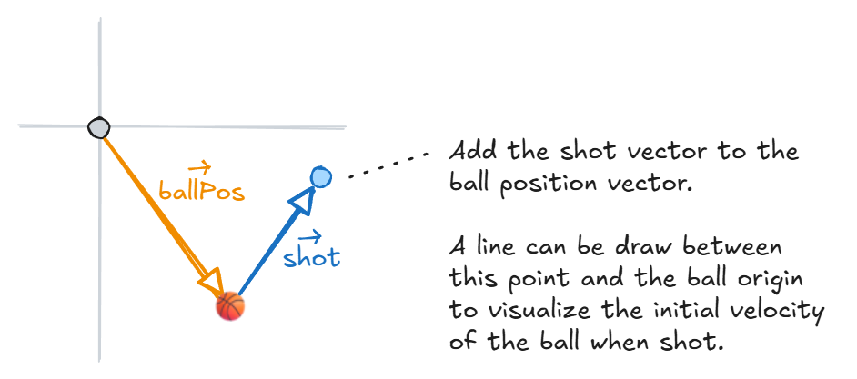
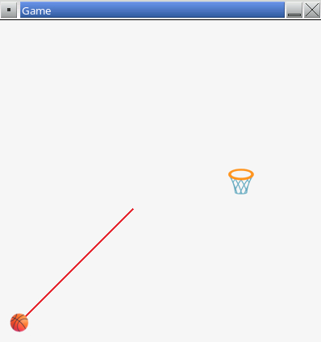
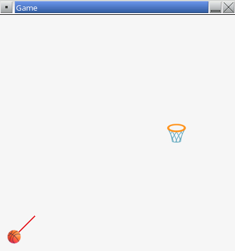

# Part 6 - Aiming

In this part of the assignment you will implement controls to allow the player to aim the ball and control the initial velocity of the shot.

## Aiming Variables

There are two values that need to be tracked:

1. Shot angle in degrees.
2. Shot power.

Both of these values are scalar values that can be stored in `float` variables.

👉 Create two global variables to track shot angle and shot power. Use an initial shot angle of `45.0f` degrees and initial shot power of `200.0f`.

## Shot Vector

Using shot angle and shot power, a vector can be computed. This is the shot vector. It indicates the initial speed and direction of the ball when shot.



To build the shot vector, start with a unit vector pointing straight up. A unit vector has a length of 1. In raylib, the y-axis is inverted (so −1 points up).



Scale the shot vector by the shot power. This controls the length of the shot vector. As the player adjusts the shot power up and down, the shot vector will grow or shrink.



Finally, rotate the shot vector based on the shot angle.



The shot vector is stored in a `Vector2` variable. The vector is recomputed each frame based on the shot angle and shot power.

👉 Create a global variable (after the shot angle and shot power variables) to track the shot vector. Use the `Vector2` data type.

Next, compute the shot vector based on the shot power and shot angle.

👉 Go to the `UpdateFrame()` function. Find the branch of code that handles when the ball is not flying. Add code to compute the shot vector. Here is an example (your variable names may differ, so update any code as necessary):

```cpp
void UpdateFrame()
{
    // Existing code...

    if (isFlying) {
        // Existing code...
    }
    else {
        // Existing code...

        // Compute shot vector
        shotVector.x = 0.0f;
        shotVector.y = -shotPower;
        shotVector = Vector2Rotate(shotVector, DEG2RAD * shotAngle);
    }
}
```

- The shot vector starts pointing straight up and is then rotated based on the shot angle.
- Notice the `y` component is set to `-shotPower`. This is because the `y` axis in our application is flipped.
- The `Vector2Rotate()` function is provided by raylib and is an easy way to rotate a vector.
- Notice the shot angle is converted from degrees to radians before use.

Finally, when the player shoots the ball, the ball's velocity needs to be updated to match the shot vector.

👉 Find the code in `UpdateFrame()` that sets the ball's velocity when the space bar is pressed. Change that code to use the shot vector's `x` and `y` components instead.

**▶️ Build and run.** When you shoot the ball, the ball's initial velocity should be computed based on the shot angle and shot power variables. Try tweaking those values, rebuilding, and observing how it affects the ball's trajectory.



## Visualizing the Shot Vector

The game should provide a visualization of the shot vector while the player is aiming.

To do this, you can draw a line coming out of the ball indicating where the player is aiming. The length of the line will indicate the shot power. The player will be able to control both the shot angle and shot power.

Drawing a line requires two `Vector2` variables: one for the start point of the line and one for the end point.



For the shot vector line, the ball's origin will be the start point. The end point will have to be computed separately.



To compute the end point for the line, you can _add_ the shot vector to the ball's origin vector.



👉 Go to the top of the `DrawFrame()` function and add new code to draw a shot vector line. Here is an example:

```cpp
void DrawFrame()
{
    // Draw shot vector
    if (!isFlying) {
        Vector2 lineEnd = Vector2Add(ballPos, shotVector);
        DrawLineEx(ballPos, lineEnd, 2, RED);
    }

    // Existing code...
}
```

**▶️ Build and run.** Notice the shot vector line is now displayed. However, it is very long and does not look proportional to the game window.



Let's scale down the line to make it more useful to the player and more visually pleasing. raylib provides a `Vector2Scale()` function to easily scale a vector.

👉 Update the line drawing code you just added to create a scaled shot vector, then use that scaled shot vector to determine where the end of the line should be. Here is an example:

```cpp
Vector2 scaledShotVector = Vector2Scale(shotVector, 0.25f);
Vector2 lineEnd = Vector2Add(ballPos, scaledShotVector);
DrawLineEx(ballPos, lineEnd, 2, RED);
```

**▶️ Build and run.** The shot vector line should look more reasonable now.



## User Control

The player should be able to control the shot angle and power before shooting the ball. You will implement this functionality next.

### Shot Angle

First, you will write code to let the player control the shot angle.

raylib provides multiple functions that help with user input. We'll mention two here:

- `IsKeyPressed()` - this was used earlier to detect if the user has pressed the space bar. This function only detects the _initial_ press of a key.
- `IsKeyDown()` - this detects if a key is currently pressed and _still is_ pressed. This is slightly different from the previous function. If you want to know if a user is _holding a key down_, use `IsKeyDown()`.

👉 Implement user control of the shot angle using the left and right arrow keys. If the player is holding the left arrow key (`KEY_LEFT`), the shot angle should decrease. If the player is holding the right arrow key (`KEY_RIGHT`), the shot angle should increase.

- How much you should add to or subtract from the shot angle during each frame update is up to you. You will have to test out different values to see what feels best to you.
- You can also choose to force the shot angle to stay within a certain range (i.e., prevent shooting in the opposite direction of the basket).

**▶️ Build and run.** You should be able to rotate the shot vector using the left and right arrow keys. When you shoot the ball, the ball's shot trajectory should reflect the chosen shot angle.

### Shot Power

Next, you will write code to let the player control the shot power.

👉 Implement user control of the shot power using the up and down arrow keys. If the player is holding the down arrow key (`KEY_DOWN`), the shot power should decrease. If the player is holding the up arrow key (`KEY_UP`), the shot power should increase.

- Similar to the shot angle, how much you should add to or subtract from the shot power during each frame update is up to you.
- You can also choose to add minimum and maximum limits to the shot power.

**▶️ Build and run.** You should be able to adjust the shot power using the up and down arrow keys.

## End of Part 6

At this point you should be able to see a line coming out of the ball representing the shot vector.

The player should be able to control the shot angle and shot power using the arrow keys. Pressing the space bar should shoot the ball in the direction of the shot vector with speed controlled by the shot power.


When ready, proceed to [part 7](./7-gravity.md).
