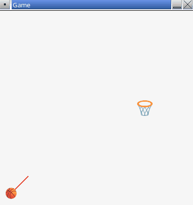

# Part 7 - Gravity

In this part of the assignment you will implement gravity and collision detection with the ground.

## Gravitational Acceleration

As the ball flies through the air, gravity should pull the ball back down. Gravity acts as a form of acceleration (a change in velocity over time). To achieve this, you only need to update the `y` component of the ball's velocity.

👉 Define a constant for gravity. You may need to adjust this value to find something that feels right.

```cpp
const float GRAVITY = 500.0f;
```

👉 Find the code that updates the ball's position inside `UpdateFrame()`. Right before updating the ball position, update the `y` component of the ball's velocity based on the acceleration of gravity. Here is an example:

```cpp
// Apply gravity
ballVel.y += GRAVITY * deltaTime;
```

- Notice that we use `+=` here. This is because the coordinate system in our application is inverted (`y` increases downward).

**▶️ Compile and run the program.** When you shoot the ball (press space bar), you should see the ball begin to fall back down towards the bottom of the screen.



## Collision with Ground

When the ball falls below the bottom of the screen, the following should happen:

- Switch `isFlying` to `false`.
- Reset the ball's position to the initial shooting position.
- Reset the ball's velocity to `{0, 0}`.

👉 In the `UpdateFrame()` function, add code to check if the ball falls below the bottom of the screen. If it does, take the actions listed above. **This check should happen only while the ball is flying.**

**▶️ Compile and run the program.** After the ball falls below the bottom of the screen, it should reset back to the initial shooting position. The player should be able to shoot multiple times in a row.

## End of Part 7

At this point:

- The player should be able to aim the ball and shoot it.
- The ball should fly through the air based on the shot angle and power as set by the player.
- Gravity should affect the ball and pull it down.
- The ball should reset back to the shooting position if it falls below the bottom of the game window.
- The player should be able to take multiple shots in a row.

When ready, proceed to [part 8](./8-scoring.md).
