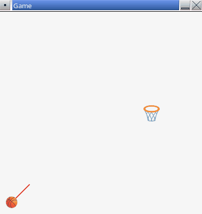
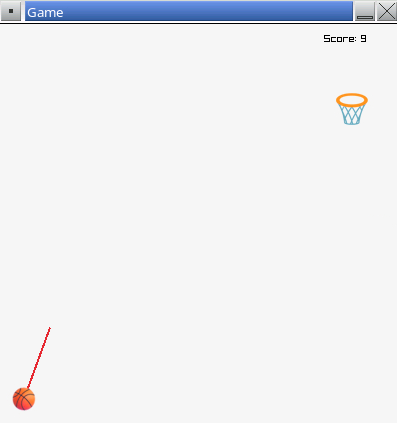
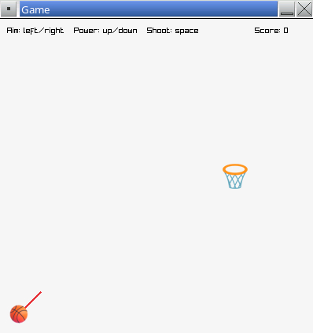

# Part 8 - Scoring

In this part of the assignment you will implement collision detection between the ball and hoop. You will also implement a points-tracking feature.

## Collision with Hoop

A simple way to detect if two objects are touching is to represent each object with a circle. If the two circles intersect, the two objects are considered to be touching.

_Note: We are not doing fully accurate detection of whether the ball goes through the hoop. For this assignment, you can keep things simple. If the ball gets close enough to the hoop, we'll treat that as a made shot._

👉 Add two new global constants to `main.cpp` defining radius values for the ball and hoop. Here is an example:

```cpp
const float BALL_RADIUS = 12.0f;
const float HOOP_RADIUS = 16.0f;
```

raylib provides a handy function, `CheckCollisionCircles()`, that lets us check if two circles are intersecting. You define a circle using a `Vector2` for the center and a `float` for the radius.

👉 In the `UpdateFrame()` function, within the code handling when the ball is flying, add code to check if the ball has collided with the hoop. Here is an example:

```cpp
// Check if the ball is within the target circle
bool isHit = CheckCollisionCircles(ballPos, BALL_RADIUS, hoopPos, HOOP_RADIUS);
if (isHit) {
    // TODO
}
```

When a hit is detected, there are multiple actions that need to be taken:

- Set `isFlying` back to `false`.
- Reset the ball's velocity to `{0, 0}`.
- Reset the ball's position to its initial shooting position.
- Update the hoop's position to a new, random location.

To get a new random value, you can use raylib's `GetRandomValue()` function. For example, to get a random value within the range `[100, SCREEN_WIDTH]`, you can use `GetRandomValue(100, SCREEN_WIDTH)`.

👉 Update the contents of the `if` statement you just added to perform the necessary actions mentioned above.

**▶️ Build and run.** When you shoot the ball and hit the hoop, the ball should reset, the hoop should move to a new position, and the player should be able to take another shot.



## Game Adjustments

Feel free to tweak any game parameters (the gravitational constant, the shot power values, the scaling factor of the shot-vector line drawing, etc.) until the basic game mechanics feel good.

## Points Tracking

👉 Update the game code to support tracking how many points the player has made. You'll need a new variable to track the number of points, and you'll need to update this variable whenever the player scores.

👉 Add code to draw how many points the player has scored on screen. Here is an example (updating any variable names as needed):

```cpp
void DrawFrame()
{
    // Draw score
    string scoreStr = "Score: " + to_string(score);
    DrawText(scoreStr.c_str(), 325, 10, 10, BLACK);

    // Existing code...
}
```

**▶️ Build and run.** The game should track and display how many points the player has made.



## Game Instructions

👉 Add a line of simple instructions to the top of the game window. You can use raylib's `DrawText()` function to do this.

**▶️ Build and run.** Verify your instructions appear at the top of the window and don't overlap the score.



## End of Part 8

At this point all the core game mechanics should work correctly and the game should track and show the player's score.

When ready, proceed to [part 9](./9-timer.md).
